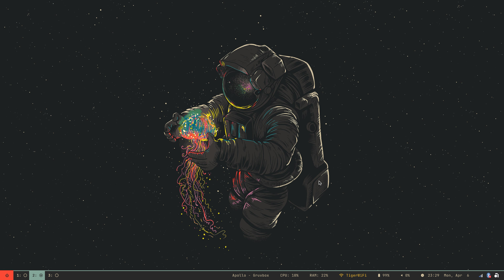
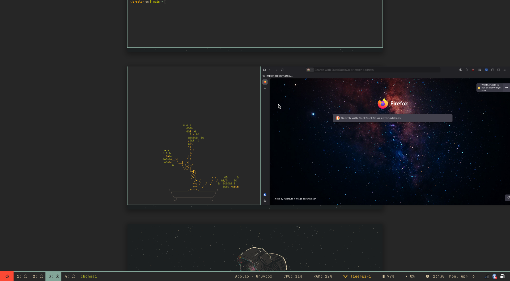
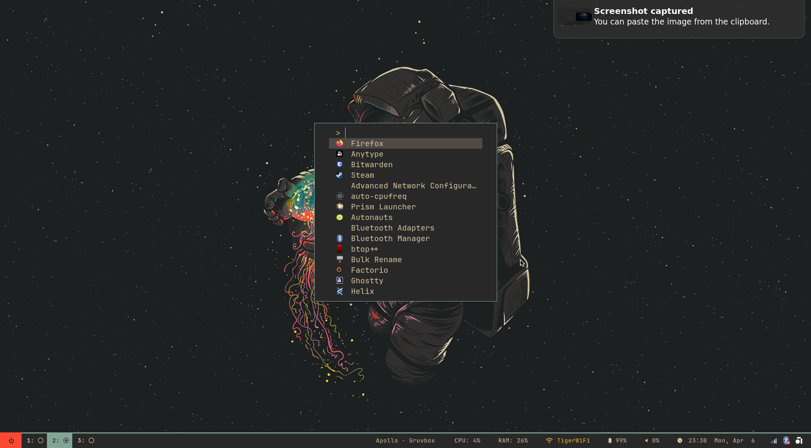

# Solar ☀️

______________________________________________________________________

## ❄️ Fully Automated Dendritic Flake

A hybrid NixOS & macOS configuration structured like a tree | Modular, Automated, and purely Nix declarative.


## 🌲 The Dendritic Tree

New features and hosts are automatically discovered and integrated. This structure treats the fleet of machines it serves as a single unified module tree, using smart recursion to filter modules based on the target platform.

```text
Solar
├── flake.nix               # Entry point (generates nixosConfigurations and darwinConfigurations)
├── flake.lock
├── assets/                 # Icons, wallpapers, and screenshots
├── modules/                # The Dendritic Core
│   ├── default.nix         # Autoscanner (filters via 'isDarwin' and 'isTotal')
│   ├── core/               # Cross-platform essentials (users, shell, nix-settings)
│   ├── darwin/             # macOS-exclusive settings (Homebrew, system defaults)
│   ├── hardware/           # Linux-exclusive hardware logic (AMD, Intel, Nvidia, etc.)
│   ├── programs/           # Feature modules (Browsers, Terminals, Media)
│   ├── services/           # System services (Networking, Game Servers, Utils)
│   ├── platforms/          # Desktop Environments (GNOME, KDE, Niri)
│   └── hosts/              # The Terminal Leaves (Individual Machine Configs)
│       ├── default.nix     # Dual-purpose host loader
│       ├── mars/           # NixOS Workstation
│       ├── phobos/         # macOS (MacBook)
│       └── venus/          # NixOS Server/Workstation
├── parts/                  # Flake-parts organization
└── templates/              # Blueprints for new hosts and features
```

## 🎨 Visual Styling

Managed via **Stylix**. Wallpapers and themes are centralized in the `assets/` folder, ensuring a consistent look (like Gruvbox or Forest) across all managed machines.

\
\


## 🚀 Enabling Features

Every module in the `/modules` directory can be enabled via a simple toggle in your host configuration:

```nix
# Inside modules/hosts/<hostname>/default.nix
myFeatures.programs.helix.enable = true;
myFeatures.platforms.niri.enable = true;
```

## ⚙️ Prerequisites

Before deploying, ensure the target machine has Nix installed with experimental features enabled in `nix.conf`:

```conf
experimental-features = nix-command flakes
```

## ⚒️ Deployment Instructions

### Initial Bootstrap

To apply a configuration to a new machine for the first time:

**NixOS:**

```bash
sudo nixos-rebuild boot --flake .#<hostname>
```

**macOS:**

```bash
nix run nix-darwin -- switch --flake .#phobos
```

### Regular Updates

Once bootstrapped, use the built-in aliases for efficiency:

```bash
# Update flake inputs
nfu  # (nix flake update)

# Apply changes (NixOS)
nrs  # (nixos-rebuild switch)
nrb  # (nixos-rebuild boot - apply on next reboot)

# Apply changes (macOS)
drs  # (darwin-rebuild switch)
```

## 🍼 Creating New Hosts

Use the provided templates to quickly spin up new configurations:

```bash
cp -r templates/hosts.nix modules/hosts/<new-host>/default.nix
```
