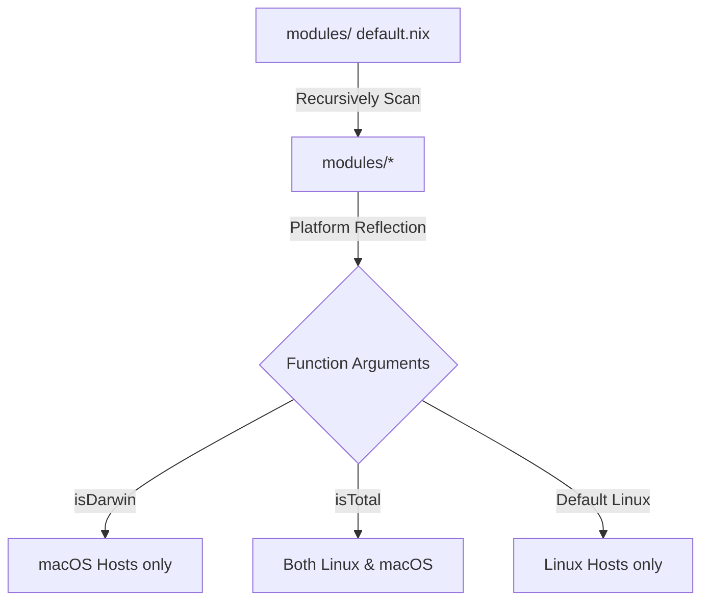

# System Architecture 🌲

The architectural foundation of **Solar** is the **Dendritic Tree**—an automated module scanner and dependency graph that models an entire constellation of heterogeneous machines as a unified, composable Nix codebase.

______________________________________________________________________

## 🏗️ Directory Hierarchy

```text
Solar
├── flake.nix               # Flake entry point & system definitions
├── flake.lock              # Pinned input flake locks
├── book.toml               # Interactive mdBook documentation configuration
├── install.sh              # Interactive deployment & provisioning script
├── INSTALL.md              # Bare-metal installation instructions
├── assets/                 # Centralized wallpapers, icons, and themes
├── docs/                   # Interactive mdBook documentation source
├── parts/                  # Flake-parts modular definitions
├── modules/                # The Dendritic Core
│   ├── default.nix         # Autoscanner with platform reflection (isDarwin & isTotal)
│   ├── core/               # Cross-platform foundation
│   │   ├── boot/           # Bootloaders (Limine, GRUB, Systemd-boot, Secure Boot)
│   │   ├── nix/            # Nix engine (Lix, Cachix, automation, settings)
│   │   ├── security/       # Security hardening (AppArmor, Agenix, SSH)
│   │   ├── shell/          # Interactive CLI (Zsh, Starship, modern tools)
│   │   └── system/         # Storage & OS (Disko, Users, Preservation, Fonts)
│   ├── darwin/             # macOS-exclusive modules (Homebrew, system defaults)
│   ├── hardware/           # Linux-exclusive hardware modules
│   │   ├── cpu-gpu/        # Drivers (AMD, Intel, Nvidia, Prime)
│   │   ├── input/          # Input peripherals (Controllers, Wooting, Trackpad)
│   │   ├── peripherals/    # Connectivity (Bluetooth, WiFi, Battery)
│   │   └── system/         # Graphics stack & TTY resolution
│   ├── platforms/          # Compositors, Window Managers & Styling
│   │   ├── desktops/       # DEs & WMs (Niri, KDE Plasma 6, GNOME, COSMIC)
│   │   ├── addons/         # Greeters, bars, widgets (ReGreet, Noctalia, Waybar)
│   │   └── styling/        # Stylix, themes & desktop flavor presets
│   ├── programs/           # Applications & suites
│   │   ├── browsers/       # Web browsers (Firefox Nightly, Zen, Chrome)
│   │   ├── media/          # Gaming, VR & Creation (Steam, TF2, VR, OBS, DaVinci)
│   │   ├── office/         # Productivity & Office (AP-Office, Joplin, Trilium)
│   │   ├── terminal/       # Shell applications (Ghostty, Helix, Antigravity, NH)
│   │   └── utilities/      # Utilities (Bitwarden, Vesktop, Spotify, Thunar)
│   ├── services/           # System daemons & background workloads
│   │   ├── hardware/       # Hardware utilities (Udisks2, Printing, OpenRGB)
│   │   ├── multimedia/     # Audio & Game Streaming (PipeWire, Sunshine, Moonlight)
│   │   ├── networking/     # Mesh networking & Web (Tailscale, Nginx, Syncthing)
│   │   ├── servers/        # Dedicated game & cloud servers (Minecraft, Factorio)
│   │   └── system/         # System daemons (Flatpak, XDG Portals)
│   └── hosts/              # Machine configurations (The Terminal Leaves)
│       ├── default.nix     # Automated host loader
│       ├── shared/         # Shared hardware profiles
│       └── <hostname>/     # Individual host definitions (default.nix + hardware-configuration.nix)
```

______________________________________________________________________

## 🔄 How the Dendritic Tree Works

In traditional Nix flakes, every single module and host must be manually registered in an imports list. Solar eliminates this boilerplate through two automated loader engines:

### 1. The Global Module Autoscanner (`modules/default.nix`)

The autoscanner recursively traverses the `modules/` directory, discovering every `.nix` file (excluding `hosts/` and `default.nix`). It inspects the top-level function arguments of each file via Nix reflection:

- **`isDarwin`**: The module is evaluated exclusively on macOS hosts (`darwinConfigurations`).
- **`isTotal`**: Universal module loaded on both Linux and macOS.
- **Linux Default**: Modules without special platform arguments are automatically imported on Linux hosts (`nixosConfigurations`) and omitted from macOS builds to prevent evaluation failures.



### 2. The Host Loader (`modules/hosts/default.nix`)

The host loader discovers every subdirectory in `modules/hosts/`:

1. **Reads Host Metadata**: Evaluates the `meta` block inside `modules/hosts/<hostname>/default.nix` for:
   - `system`: System architecture (e.g. `x86_64-linux`, `aarch64-darwin`, `aarch64-linux`).
   - `stable`: Whether to evaluate against `nixpkgs-stable` or `nixpkgs-unstable`.
   - `useSolarSecrets`: Enables Agenix decryption of private secrets.
1. **Dispatches System Builder**: Calls `pkgs.lib.nixosSystem` for Linux or `inputs.nix-darwin.lib.darwinSystem` for macOS.
1. **Injects Framework Modules**: Automatically hooks Home Manager, Disko, Preservation, Stylix, and Agenix into every host configuration.

______________________________________________________________________

## 👥 Dynamic Multi-User Generation

Solar modules avoid hardcoding individual usernames. Instead, Home Manager configurations and impermanence preservation directories are mapped dynamically across all users declared in `config.myFeatures.core.system.users.usernames`:

```nix
home-manager.users = lib.genAttrs config.myFeatures.core.system.users.usernames (name: {
  # Per-user configuration generated dynamically
});
```

This guarantees consistent dotfiles, desktop styles, and toolchains across all users on single-user and multi-user machines alike.

______________________________________________________________________

## 💾 Storage & Preservation Lifecycle

Solar integrates ephemeral root filesystems with high-speed NVMe and bulk HDD storage tiers:

1. **Ephemeral Root**: Root (`/`) is mounted on an in-memory `tmpfs` that is completely wiped on reboot.
1. **Speed Tier (`/persist`)**: Stateful dotfiles, SSH keys, logs, and user data survive reboots on high-speed NVMe Btrfs subvolumes.
1. **Cold/Bulk Tier (`/persist/bulk`)**: High-capacity multi-disk HDD pools are mounted with `neededForBoot = true` for large media archives, Steam libraries, and server data.
