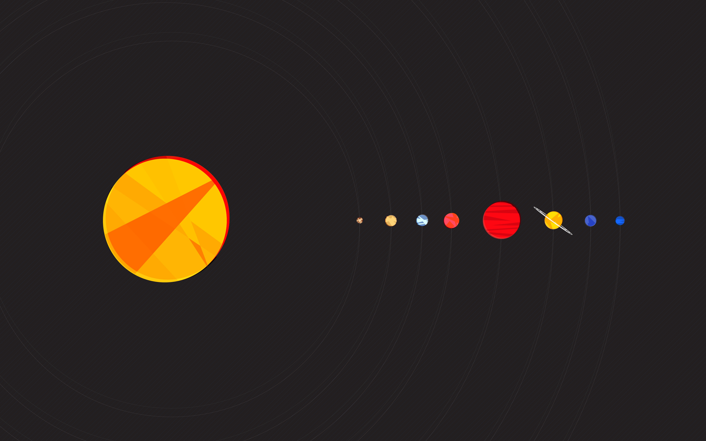

# Solar Documentation ☀️

Welcome to the official documentation for **Solar** — a high-performance, hybrid NixOS and macOS configuration structured as an automated, dendritic flake.

______________________________________________________________________

## 🌟 What is Solar?

Solar manages a diverse constellation of personal workstations, portable laptops, handheld gaming consoles, high-performance servers, dedicated NAS nodes, and general storage pools from a single unified repository.

### Core Architecture Highlights

- 🌲 **Dendritic Module Tree**: Self-discovering module graph with automatic platform filtering for Linux and macOS (`isDarwin` / `isTotal`).
- 💾 **Universal Hardware-Aware Disko**: Single declarative storage engine supporting single-disk, multi-disk speed pools, and high-capacity bulk pools with Btrfs.
- 🧹 **Ephemeral Root Filesystem**: Wipe-on-boot root on `tmpfs` with multi-tier state preservation on NVMe speed (`/persist`) and HDD bulk (`/persist/bulk`) storage.
- 🛡️ **Zero-Compromise Security**: AppArmor MAC profiles, kernel hardening, LUKS2 disk encryption, native Secure Boot with Limine, TPM 2.0 hardware auto-unlock, and Agenix secrets.
- 🎮 **Esports & Gaming Suite**: Native 64-bit Steam with Gamescope, competitive Team Fortress 2 suite with low-latency net rates and match demo recording, Mumble VoIP with Wayland push-to-talk, Prism Launcher, and Unified VR (WiVRn / ALVR).
- 🎨 **Centralized Theming**: Stylix theming with custom desktop flavors (`sky`, `gruvbox`, `strawberry`, `forest`, `space`) across Niri, KDE Plasma 6, GNOME, COSMIC, Noctalia, and Waybar.
- 🚀 **Zero-Secret Bootstrap**: Standalone hosts run completely self-contained without requiring access to private secret repositories.

______________________________________________________________________

## 🧭 Navigation Guide

Use the sidebar on the left or press <kbd>S</kbd> to search anywhere in this book:

### 🪐 The Fleet

- **[Fleet Overview](fleet/overview.md)**: Summary of all 11 machines in the constellation.
- **[Workstations & Portables](fleet/workstations.md)**: Mars (Workstation), Mercury (Laptop), and Phobos (MacBook).
- **[Gaming, VR & Rigs](fleet/gaming-vr.md)**: Elara (Streaming rig), Europa (VR workstation), and Amalthea (Handheld console).
- **[The Jupiter Moon Stack](fleet/jupiter-stack.md)**: Thebe (Compact server), Ganymede (NAS), and Callisto (Storage & Backup).
- **[Server & Cloud Infrastructure](fleet/servers.md)**: Venus (Multi-service cloud) and Io (COSMIC testbed).

### 🎨 Platforms & Theming

- **[Desktop Environments](platforms/desktops.md)**: Niri scrollable tiling compositor, KDE Plasma 6, GNOME, and COSMIC Desktop.
- **[Shell, Bar & Addons](platforms/addons.md)**: ReGreet greeter, SDDM, Noctalia Shell, Waybar, Ironbar, SwayNC notifications, and SwayOSD.
- **[Styling & Flavors](platforms/styling.md)**: Stylix color schemes, desktop flavor presets, and custom ricing.

### 🎮 Software Suites & Toolchains

- **[Gaming & Esports Suite](programs/gaming.md)**: Steam, Gamescope, Competitive TF2 Suite, Mumble VoIP, and Prism Launcher.
- **[Virtual Reality Suite](programs/vr.md)**: Meta Quest wired USB ADB streaming, WiVRn OpenXR, ALVR, Monado, and SideQuest.
- **[Terminal & Developer Tools](programs/terminal.md)**: Ghostty GPU terminal, Helix editor, Antigravity AI assistant, Fastfetch, and Nix-LD.
- **[Media Production](programs/media.md)**: DaVinci Resolve, OBS Studio (VAAPI & PipeWire capture), and MPV GPU acceleration.
- **[Productivity & Office](programs/productivity.md)**: Firefox Nightly, Zen Browser, Bitwarden, Vesktop, and AP-Office.

### 🌐 Services & Daemons

- **[Networking & VPN](services/networking.md)**: Tailscale mesh network, systemd-resolved DNS, Syncthing, Dynamic DNS, and Nginx SSL proxy.
- **[Multimedia & Streaming](services/multimedia.md)**: PipeWire low-latency audio stack, Sunshine GameStream server, and Moonlight.
- **[Dedicated Servers](services/servers.md)**: Minecraft Create Aero & SLLV, Factorio, Terraria, Joplin, Zotero, Samba SMB3, and NFSv4.

### 💾 Storage & Security

- **[Universal Hardware-Aware Disko](storage/disko.md)**: Declarative storage engine, speed pools, and bulk pools.
- **[Wipe-on-Boot & Preservation](storage/preservation.md)**: Ephemeral root tmpfs and declarative persistent storage.
- **[Drive Swapping & Maintenance](storage/drive-swapping.md)**: Disk replacement and partition cloning procedures.
- **[Full-Disk LUKS2 Encryption](security/luks.md)**: Multi-disk single-prompt caching and recovery key slots.
- **[Native Secure Boot](security/secureboot.md)**: Limine UEFI signing with `sbctl`.
- **[TPM 2.0 Auto-Unlock](security/tpm2.md)**: Tamper-proof hardware binding with `systemd-cryptenroll`.
- **[Encrypted Secrets with Agenix](security/agenix.md)**: Asymmetric Age encryption and memory key management.

### 🛠️ Deployment & Guides

- **[Bare-Metal Installation Guide](deployment/installation.md)**: Automated and manual deployment steps.
- **[Routine Maintenance](deployment/maintenance.md)**: Rebuild aliases, garbage collection, and Btrfs scrubbing.
- **[How Modules Work](guides/how-modules-work.md)**: Deep dive into the dendritic module system.
- **[Setting Up a Desktop](guides/setting-up-a-desktop.md)**: Step-by-step desktop blueprint.
- **[Setting Up a Server](guides/setting-up-a-server.md)**: Step-by-step headless server blueprint.
- **[Adding a Host](guides/adding-a-host.md)**: Creating and deploying a new machine.
- **[Adding a Feature Module](guides/adding-a-feature.md)**: Building composable NixOS/Home Manager features.
