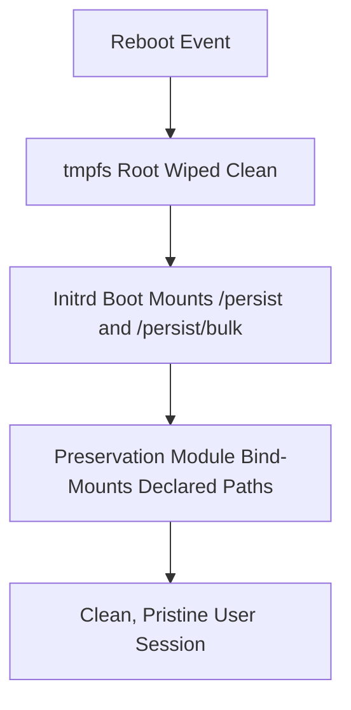

# Wipe-on-Boot Impermanence & Preservation 🧹

Solar implements an ephemeral root filesystem architecture (wipe root on boot) backed by declarative multi-tier persistent storage.

______________________________________________________________________

## 🏛️ How Wipe-on-Boot Works

On hosts with `myFeatures.core.system.core-branch.usePersistence = true` (**Mars** and **Mercury**):

1. **Root on `tmpfs`**: The root filesystem (`/`) is created as an in-memory `tmpfs`. Every reboot wipes temporary files, leftover caches, broken symlinks, and root alterations completely.
1. **Persistent Storage (`/persist`)**: Stateful files, SSH keys, user home directories, and application configurations are stored on an encrypted Btrfs NVMe subvolume mounted at `/persist`.
1. **Bulk Storage (`/persist/bulk`)**: Cold storage archives and secondary Steam libraries are stored on multi-disk HDD pools mounted at `/persist/bulk`.



______________________________________________________________________

## 📝 Declaring Preserved Paths in Modules

Each Solar module declares the files and directories it requires to survive reboots:

```nix
preservation.preserveAt."${config.myFeatures.core.system.preservation.persistentPath}" =
  lib.mkIf config.myFeatures.core.system.preservation.enable {
    users = lib.genAttrs config.myFeatures.core.system.users.usernames (_name: {
      directories = [
        ".config/myapp"
        ".local/share/myapp"
      ];
      files = [
        ".myapp_session"
      ];
    });
  };
```

______________________________________________________________________

## 📊 Default Preserved Directories

The core preservation module (`modules/core/system/users.nix`) automatically preserves essential user state:

- **User Data**: `Documents`, `Downloads`, `Pictures`, `Videos`, `Desktop`, `src`
- **Keys & Credentials**: `.ssh`, `.gnupg`, `.pki`, `.local/share/keyrings`
- **Application State**: `.local/share/applications`, `.local/state`, `.cache/nix`, `.config/Mumble`, `.local/share/Steam`
